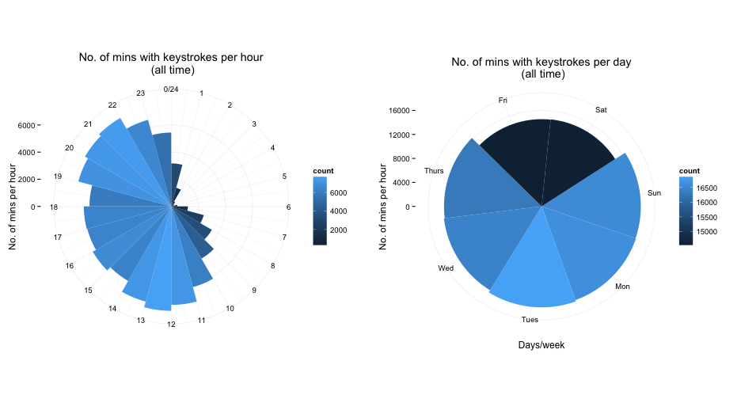

### What is persanalytics? ###

persanalytics is a report and analysis document in which I hope to aggregate all the personal analytics I collect.

persanalytics contains (for now):

- keystroke frequency information collected using [minute-agent][minute] ([my modified fork][minute-sh]).
- (_coming soon_) Details of my cycling training using data collected from a [Garmin Edge 500][Garmin500].

This is all so I can play around with data and practice plotting and analyzing it, and get some insight into changes over time in the process.

### Technical notes ###

persanalytics is an [R][R] markdown document (`.Rmd`) written in [RStudio][RStudio]. RStudio uses the [knitr][knitr] package to combine the R and markdown code into a single html document. I don't think you _have_ to use RStudio to edit and 'knit' R markdown files, but it makes it easier.

I will plot everything using [ggplot2][ggplot2] because it's awesome.

### Example plots ###

[R]: https://en.wikipedia.org/wiki/R_Statistics
[RStudio]: http://www.rstudio.com
[minute]: https://github.com/tmcw/minute-agent
[minute-sh]: https://github.com/sheriferson/minute-agent
[Garmin500]: https://buy.garmin.com/en-US/US/into-sports/cycling/edge-500/prod36728.html
[knitr]: http://yihui.name/knitr/
[ggplot2]: http://docs.ggplot2.org/current/
