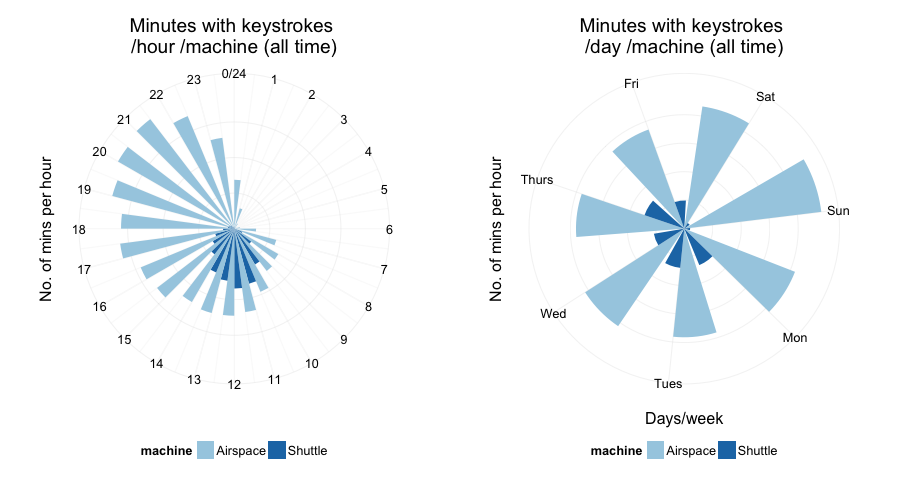
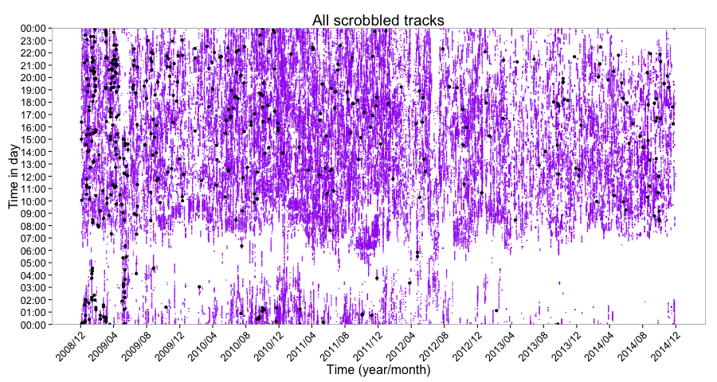

### What is persanalytics? ###

persanalytics is a report and analysis document in which I hope to aggregate all the personal analytics I collect.

persanalytics contains (for now):

- keystroke frequency information collected using [minute-agent][minute] ([my modified fork][minute-sh]).
- Records of todo items (current and completed) managed using [t][t] (no plots, yet).
- Cycling data collected using a [Garmin Edge 500][Garmin500].
- [My last.fm][lastfm] scrobbled tracks.

This is all so I can play around with data and practice plotting and analyzing it, and get some insight into changes over time in the process.

My goal is to collect and visualize data that goes back years. Keystrokes, emails, messages/SMS, and any physical activities I can record. See [Stephen Wolfram's personal analytics post][wolfram].

### Technical notes ###

persanalytics is an [R][R] markdown document (`.Rmd`) written in [RStudio][RStudio]. RStudio uses the [knitr][knitr] package to combine the R and markdown code into a single html document. I don't think you _have_ to use RStudio to edit and 'knit' R markdown files, but it makes it easier.

I will plot everything using [ggplot2][ggplot2] because it's awesome.

### todos ###

I use [t][t] to manage my todos, and I love it. It is the only task-management system that has ever worked for me.

I wrote `todos.R` to load the text files `tasks.txt` and `.tasks.txt.done`, count the number of current and completed tasks, and append it to `data/todos.csv`.

Finally, I am using [LaunchControl][LaunchControl] (a GUI for managing [launchd][launchd] jobs on OS X) to run the following command every 3600 seconds:

```bash
/usr/bin/rscript --vanilla Users/sherif/persanalytics/todos.R
```

Once I have enough data points in `data/todos.csv`, I'll start figuring out what plots I can make.


## Plots ##

### keystrokes ###





### todos ###

Nothing too interesting to plot out of those yet, so I'm just plotting the number of current and completed items for now.


### cycling ###

My sensors don't measure which gear I'm in, so I created a pseudo "average gear" score:

`gear score = total strokes / distance`

The higher the value, the smaller the gear.

- The larger the point, the higher the gear.
- The redder the point, the higher the average heart rate .

Average heart rate is a good metric for how intense a training session was.


### music ###

I am especially happy that I could finally get my music data. There is a clear pattern that I long knew/suspected, but am still impressed I can see in the plots: I love music, but I'm been listening to less of it lately. My expanding podcast subscriptions are largely to blame for that. Why can't I have more than 24 hours a day... 



Even though the following plot implies that I am "loving" fewer and fewer tracks as time goes on, that is false. I am always finding tracks that I can't stop listening to, I just don't use the "Love this track" feature of last.fm as much as I used to.


### Data on the todo list ###

The following data is being collected, I just need to figure out how to obtain/parse them.

- IM chat logs (`xml`).
- Email (incoming and outgoing).


[minute]: https://github.com/tmcw/minute-agent
[minute-sh]: https://github.com/sheriferson/minute-agent

[t]: https://github.com/sjl/t

[Garmin500]: https://buy.garmin.com/en-US/US/into-sports/cycling/edge-500/prod36728.html

[wolfram]: http://blog.stephenwolfram.com/2012/03/the-personal-analytics-of-my-life/

[R]: https://en.wikipedia.org/wiki/R_Statistics
[RStudio]: http://www.rstudio.com

[knitr]: http://yihui.name/knitr/
[ggplot2]: http://docs.ggplot2.org/current/

[LaunchControl]: http://www.soma-zone.com/LaunchControl/
[launchd]: http://launchd.info)

[lastfm]: http://www.last.fm/user/thespeckofme
