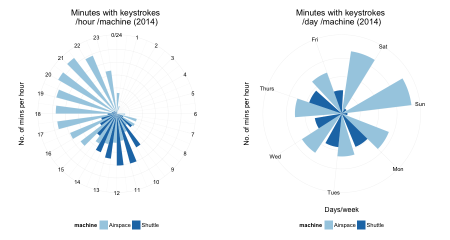
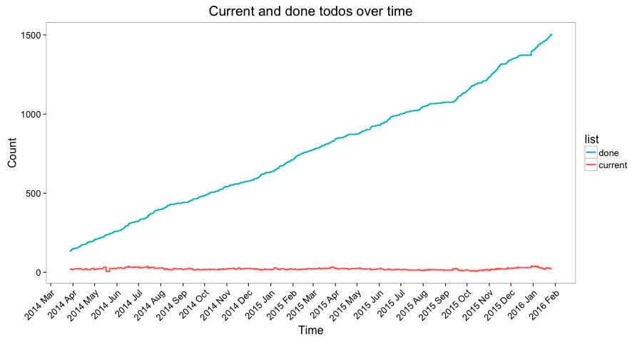
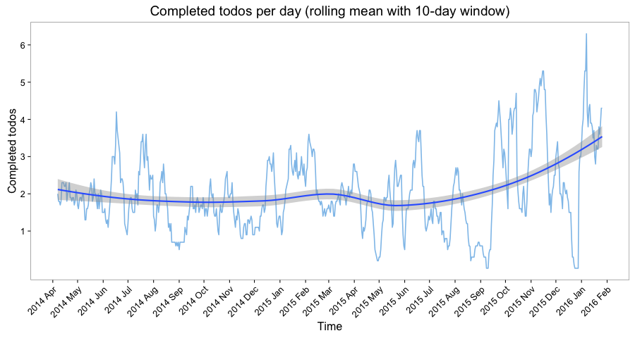
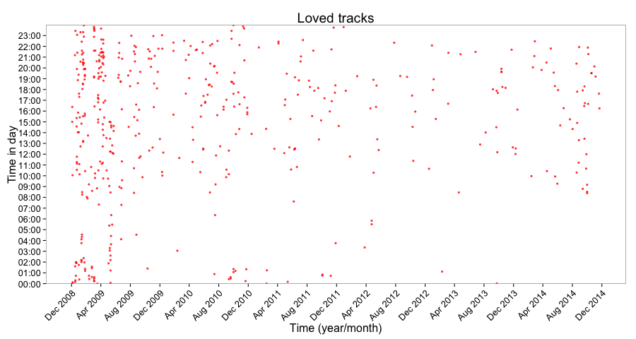

## What is persanalytics?

persanalytics is a repo in which I collect and visualize personal analytics.

persanalytics contains (for now):

- **keystroke** frequency information collected using [minute-agent][minute] ([my modified fork][minute-sh]).
- **todos** (current and completed) managed using [t][].
- **cycling** data collected using a [Garmin Edge 500][Garmin500].
- **music** tracks scrobbled on [last.fm][lastfm].
- **instant messaging** chat logs (`xml` logs collected using [Adium][]).

This is all so I can play around with data and practice plotting and analyzing it, and get some insight into changes over time in the process. My goal is to collect and visualize data that goes back years. Keystrokes, emails, messages/SMS, and any physical activities I can record.

See also:

- [Stephen Wolfram's personal analytics post][wolfram].


## Plots

### keystrokes





### todos



These are completed todos per day.
The data look too erratic on their own, so I added a [loess][] [smoothing][] function.


After a while, the above plot loses its usefulness. The lines are pushed against each other and, aside from the loess smoothing overlay, the viewer doesn't get any information from the line plot itself.

This is a good time to use a simple [rolling mean](https://en.wikipedia.org/wiki/Moving_average "Moving average - Wikipedia, the free encyclopedia").



That's better.

### cycling

My sensors don't measure which gear I'm in, so I created a pseudo "average gear" score:

`gear score = total strokes / distance`

The higher the value, the smaller the gear.

- The larger the point, the higher the gear.
- The redder the point, the higher the average heart rate .

Average heart rate is a good metric for how intense a training session was.


### music

I am especially happy that I can finally get my music data. There is a clear pattern that I long knew/suspected, but am still impressed I can see in the plots: I love music, but I've been listening to less of it lately. The main reason is that I'm listening to more and more podcasts.


Even though the following plot implies that I am "loving" fewer and fewer tracks as time goes on, I think that's misleading. I am always finding tracks that I can't stop listening to, I just don't use the "Love this track" feature of last.fm as much as I used to.




### instant messaging

I love [regular expressions](http://regexone.com).

I got around to merging and parsing the logs from my most recent IM account. According to the final tally, there are **79715** messages that I've sent and received using that account since September 2012.


<!-- --------------------------------------------- -->

## Technical notes

persanalytics is a collection of [R][] (`.R`) scripts written in [RStudio][]. Each script, when run, will perform all the needed merging, crunching, nip 'n tucking, and plotting needed to arrive at the final plots, and saves them to `peranalytics/plots/`.

All plots are made using the [ggplot2][ggplot2] library/package because it's awesome.

### keystrokes

As mentioned above, keystrokes frequencies per min are collected using [minute-agent][minute]. `keystrokes.R` reads the `.log` file and handles the rest.

### todos

I use [t][t] to manage my todos, and I love it. It is the only task-management system that has ever worked for me.

`t` saves current todos in a file called `tasks.txt` and all completed todos in `.tasks.txt.done`. `todos.R` reads both text files, counts the number of current and completed tasks, and appends it to `data/todos.csv`. It also produces the above plot.

I am using [LaunchControl][] (a GUI for managing [launchd][] jobs on OS X) to run the following command every 3600 seconds:

```bash
/usr/bin/rscript --vanilla Users/sherif/persanalytics/todos.R
```

### music

I [scrobble](http://www.last.fm/help/faq?category=Scrobbling) all [my music](http://www.last.fm/user/thespeckofme). last.fm allows you to request your listening archive. You receive `.tsv` and `.json` files of your total, loved, banned, bootstrapped, and skipped tracks. `music.R` reads in the `.tsv` file and does what it does.

### instant messaging

I've been using [Adium](https://www.adium.im) since I first started using a Mac. This was a great decision because it means that even back when I was using Google Chat, I had all my chat logs stored locally. Adium saves chat logs in

`~/Library/Application Support/Adium 2.0/Users/Default/Logs`

However, I keep my Adium 2.0 folder [symlinked](https://en.wikipedia.org/wiki/Symbolic_link) on Dropbox, which means that all my settings and chat logs are kept in sync between my two computers. It works surprisingly well.

Within `Logs`, there is a folder per account. Within those there is a folder per contact. Within those a folder (with an extension `.chatlog`) per conversation, and within _those_ `.xml` files with the content of the conversations.

`IM.R` executes a bash command to `cat` all of those scattered `.xml` files into one `mergedIM.xml` file, which it then reads in and does some regex stuff to split it into the interesting components.

If there is an easier way to parse `xml` using R, I don't know it.

### Data on the todo list

The following data is being collected, I just need to figure out how to obtain/parse them.

- Email (incoming and outgoing).


[minute]: https://github.com/tmcw/minute-agent
[minute-sh]: https://github.com/sheriferson/minute-agent

[t]: https://github.com/sjl/t

[Garmin500]: https://buy.garmin.com/en-US/US/into-sports/cycling/edge-500/prod36728.html
[Adium]: https://www.adium.im

[wolfram]: http://blog.stephenwolfram.com/2012/03/the-personal-analytics-of-my-life/

[loess]: http://en.wikipedia.org/wiki/Local_regression
[smoothing]: http://docs.ggplot2.org/current/geom_smooth.html

[R]: https://en.wikipedia.org/wiki/R_Statistics
[RStudio]: http://www.rstudio.com

[knitr]: http://yihui.name/knitr/
[ggplot2]: http://docs.ggplot2.org/current/

[LaunchControl]: http://www.soma-zone.com/LaunchControl/
[launchd]: http://launchd.info

[lastfm]: http://www.last.fm/user/thespeckofme
